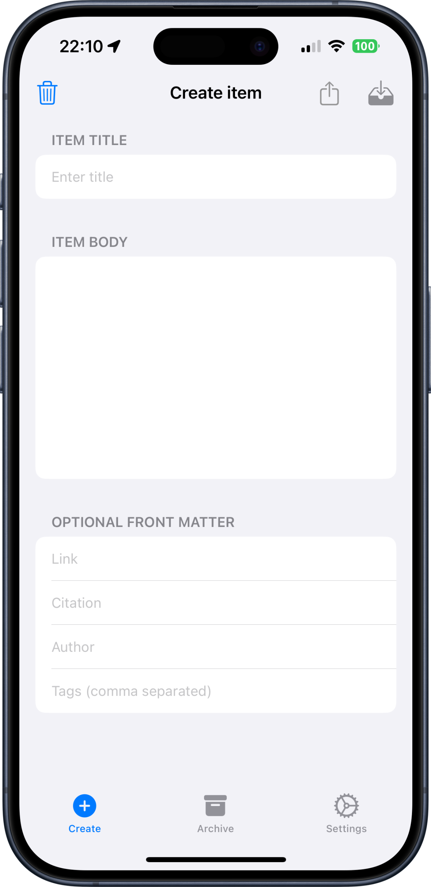

# Hiyd - Jekyll Companion App

Generate markdown content for your Jekyll sites with ease. Create posts with front matter quickly on iOS and Chrome.

## ✨ Features

- **Quick Markdown Generation**: Create Jekyll-formatted markdown content instantly
- **Front Matter Support**: Automatically generate proper YAML front matter
- **Jekyll-Specific Formatting**: Built specifically for Jekyll site workflows
- **Local Storage Only**: Your content stays on your device - complete privacy
- **Cross-Platform**: Available on iOS and as a Chrome extension
- **Offline Ready**: Works completely offline once installed
- **Live Preview**: See your content formatted before saving

## 🚀 Getting Started

### iOS App

1. Download from the [App Store](https://apps.apple.com/app/hiyd/idXXXXXXXXX)
2. Open the app and start creating content
3. Generate front matter for your posts
4. Copy and paste into your Jekyll site

### Chrome Extension

1. Install from the [Chrome Web Store](https://chrome.google.com/webstore/detail/hiyd/hkeklhoojnogpfmiikadpcmkmpldhpce)
2. Click the Hiyd icon in your browser toolbar
3. Create markdown content directly in your browser
4. Save or copy to your Jekyll project

## 📝 Use Cases

- **Blog Posts**: Quickly create new blog posts with proper front matter
- **Documentation**: Generate markdown pages for documentation sites
- **Project Pages**: Create project showcase pages
- **Learning**: Practice Jekyll and markdown formatting
- **Content Migration**: Convert existing content to Jekyll format

## 🔒 Privacy & Security

Hiyd is built with privacy as a core principle:

- **No data collection**: We don't collect any personal information
- **Local processing**: All operations happen on your device
- **Offline operation**: No internet connection required after installation
- **No accounts**: No sign-up or login required

Read our full [Privacy Policy](privacy.md) and [Security Policy](security.md).

## 🛠️ Technical Details

### Supported Jekyll Features

- YAML front matter generation
- Markdown content formatting
- Date and permalink handling
- Category and tag management
- Custom variable support

### Platform Requirements

- **iOS**: iOS 14.0 or later
- **Chrome**: Chrome 88 or later
- **Storage**: Minimal local storage usage

## 📱 Screenshots

*iOS App Interface*

## 🆘 Support

Need help? We're here for you:

- **Email**: [support@hiyd.uk](mailto:support@hiyd.uk)
- **Website**: [hiyd.uk](https://hiyd.uk)

## 📄 Legal

- [Terms of Service](terms.md)
- [Privacy Policy](privacy.md)
- [Security Policy](security.md)

## 🏗️ Built For Jekyll Users

Hiyd is specifically designed for Jekyll users who want to streamline their content creation workflow. Whether you're maintaining a personal blog, documentation site, or company website, Hiyd makes Jekyll content creation faster and more enjoyable.

---

© 2025 Hiyd. Made with ❤️ for the Jekyll community.
